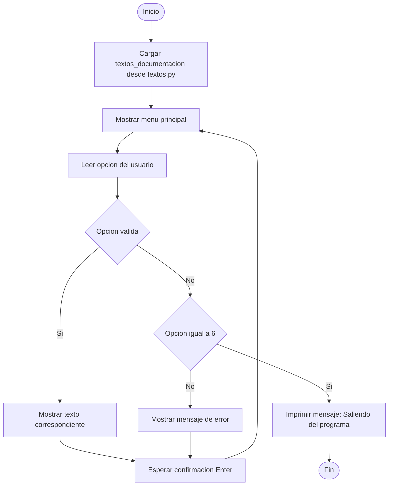

# 🧾 Documentación – Proyecto Tienda Aurelion  
**1° Demo: Asincrónica (Sprint 1 – Fundamentos de Inteligencia Artificial, IBM)**  

---

## 1️⃣ Tema, problema y solución  

### 🧠 Tema  
**Gestión de datos de una tienda minorista** mediante la integración de información de clientes, productos y transacciones de venta.  
El proyecto *Tienda Aurelion* utiliza datos sintéticos representativos de un comercio real para comprender cómo los sistemas de información pueden organizar, describir y analizar datos comerciales.  

---

### ⚠️ Problema  
La tienda almacena sus registros en distintos archivos (`clientes`, `productos`, `ventas` y `detalle_ventas`), sin un sistema central que permita comprender la estructura y relación entre ellos.  
Esta fragmentación de la información dificulta tareas clave como:  
- identificar los productos más vendidos o las categorías con mayor demanda,  
- analizar los medios de pago más utilizados,  
- conocer la evolución de clientes por ciudad o fecha de alta, y  
- realizar proyecciones basadas en datos históricos.  

En consecuencia, el negocio carece de una **visión integrada y analítica de su operación**, lo que limita la toma de decisiones basadas en evidencia.  

---

### 💡 Solución  
Desarrollar un **visor interactivo de documentación** en Python que permite explorar, desde la terminal, toda la información descriptiva del proyecto:  
- tema y propósito,  
- definición y estructura del dataset,  
- descripción de las tablas y escalas de medición,  
- sugerencias de mejora para futuras etapas (como búsqueda o exportación).  

El objetivo de esta primera entrega es **entender los datos** antes de procesarlos o analizarlos.  
El visor constituye el primer componente de una solución analítica más amplia, en la que luego podrán incorporarse visualizaciones (Power BI o Matplotlib) y modelos predictivos (IA).  

---

### 🔍 Contexto basado en los datos
| Tabla | Rol dentro del proyecto | Ejemplo de análisis posible |
|--------|--------------------------|------------------------------|
| **productos** | Describe el catálogo de artículos, categorías y precios. | Comparar precios promedio por categoría. |
| **clientes** | Registra información personal, ciudad y fecha de alta. | Analizar distribución de clientes por ciudad o por mes. |
| **ventas** | Consolida las operaciones con fecha y medio de pago. | Detectar tendencias de medios de pago o ventas por periodo. |
| **detalle_ventas** | Detalla los productos vendidos en cada operación. | Calcular top 10 de productos más vendidos o ticket promedio. |

---

## 2️⃣ Dataset de referencia  

**Fuente:**  
Datos sintéticos generados con fines educativos, para representar la operación de una tienda minorista.  

**Definición:**  
Conjunto de archivos que simulan un entorno de ventas, integrando catálogo de productos, registro de clientes, operaciones de venta y detalles de cada transacción.  

---

### **Estructura de los archivos**  

#### 🛍️ Productos (`productos.csv`)
| Campo | Tipo | Escala |
| :--- | :--- | :--- |
| id_producto | int | Nominal |
| nombre_producto | str | Nominal |
| categoria | str | Nominal |
| precio_unitario | int | Razón |

#### 👥 Clientes (`clientes.csv`)
| Campo | Tipo | Escala |
| :--- | :--- | :--- |
| id_cliente | int | Nominal |
| nombre_cliente | str | Nominal |
| email | str | Nominal |
| ciudad | str | Nominal |
| fecha_alta | date | Intervalo |

#### 💳 Ventas (`ventas.csv`)
| Campo | Tipo | Escala |
| :--- | :--- | :--- |
| id_venta | int | Nominal |
| fecha | date | Intervalo |
| id_cliente | int | Nominal |
| nombre_cliente | str | Nominal |
| email | str | Nominal |
| medio_pago | str | Nominal |

#### 📦 Detalle_Ventas (`detalle_ventas.csv`)
| Campo | Tipo | Escala |
| :--- | :--- | :--- |
| id_venta | int | Nominal |
| id_producto | int | Nominal |
| nombre_producto | str | Nominal |
| cantidad | int | Razón |
| precio_unitario | int | Razón |
| importe | int | Razón |

---

## 3️⃣ Información, pasos, pseudocódigo y diagrama  

### 📋 **3.1 Contenidos accesibles desde el menú**
- Tema, problema y solución  
- Dataset de referencia  
- Estructura por tabla  
- Escalas de medición  
- Sugerencias y mejoras con Copilot  
- Salir  

---

### ⚙️ **3.2 Pasos del programa**
1. Cargar en memoria los textos de la documentación (desde `textos.py`).  
2. Mostrar un menú con las secciones anteriores.  
3. Esperar que el usuario seleccione una opción.  
4. Imprimir la información correspondiente.  
5. Volver al menú hasta que el usuario elija “Salir”.  

---

### 💻 **3.3 Pseudocódigo**
```pseudocode
INICIO
    CARGAR textos_documentacion desde textos.py
    MIENTRAS VERDADERO:
        LIMPIAR_PANTALLA
        MOSTRAR_MENU
            1. Tema, problema y solución
            2. Dataset de referencia
            3. Estructura por tabla
            4. Escalas de medición
            5. Sugerencias y mejoras con Copilot
            6. Salir
        LEER opcion_usuario
        SEGUN opcion_usuario:
            CASO 1: MOSTRAR textos_documentacion['tema']
            CASO 2: MOSTRAR textos_documentacion['dataset']
            CASO 3: MOSTRAR textos_documentacion['estructura']
            CASO 4: MOSTRAR textos_documentacion['escalas']
            CASO 5: MOSTRAR textos_documentacion['sugerencias']
            CASO 6: IMPRIMIR "Saliendo del programa." y ROMPER
            CASO CONTRARIO: IMPRIMIR "Opción no válida."
        ESPERAR_CONFIRMACION
FIN

```

### 3.4 Diagrama de flujo




## 4️⃣ Sugerencias y mejoras aplicadas con Copilot  

A continuación se detallan las funcionalidades sugeridas durante el desarrollo del proyecto y su estado actual.  

### ✅ Aplicadas
- Separar la documentación en plantillas reutilizables (`textos.py`).
- Limpiar la pantalla antes de mostrar el menú.
- Agregar pausa tras mostrar resultados.

### 🚧 Pendientes
- Implementar modo **“búsqueda”** de palabras clave dentro de la documentación.
- Agregar opción **“exportar sección”** para guardar en `.txt` o `.md`.
- Incluir tests automáticos para verificar que cada número abra la sección correcta.

---

## 5️⃣ Archivos del proyecto  

| Archivo | Descripción |
|----------|-------------|
| `programa.py` | Código principal del visor interactivo. |
| `textos.py` | Contiene los textos de la documentación. |
| `Instrucciones.md` | Prompts de Copilot utilizados durante el desarrollo. |
| `Documentacion.md` | Documento principal de descripción del proyecto. |
| `diagrama_flujo.png` | Diagrama visual complementario. |

---

## ✅ **Conclusión**

La primera demo establece los fundamentos del proyecto **Tienda Aurelion**:  
- Comprender el **contexto del dataset** y el valor de los datos.  
- Implementar un **programa estructurado** que refleje el pensamiento computacional.  
- Aplicar **IA (Copilot/ChatGPT)** para asistir en la documentación y mejora del código.  

> Esta entrega representa el inicio del ciclo de análisis de datos:  
> **de la comprensión de la estructura al desarrollo de soluciones inteligentes.**
