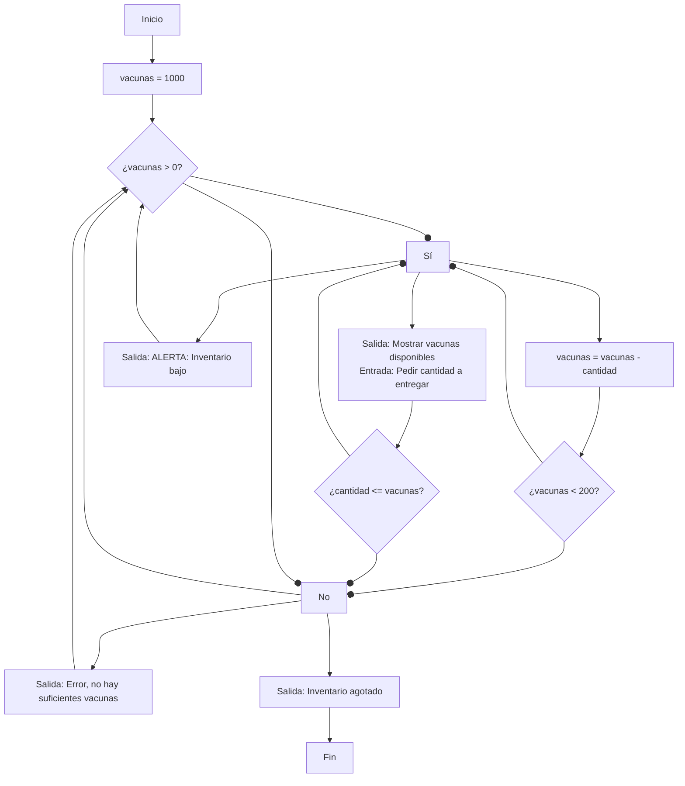
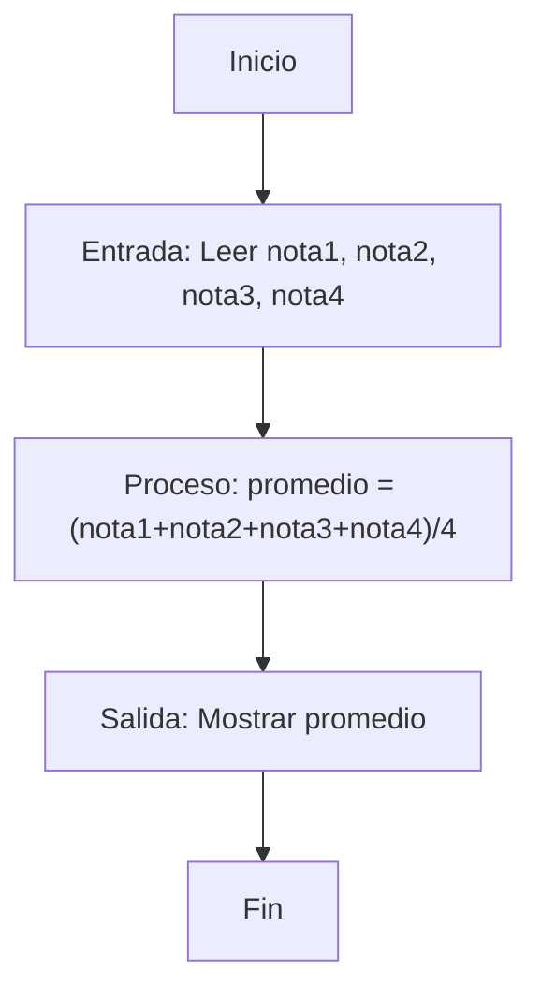

# EJERCICIOS

- Una ONG tiene puntos de reparto de vacunas que se pretende funcionen de la siguiente manera. Cada día, empezar con 1000 vacunas disponibles y a través de un programa que controla las entregas avisar si el inventario baja de 200 unidades. Desarrollar pseudocódigo y diagrama de flujo.

- Desarrolle un algoritmo que permita leer dos valores distintos, determinar cual de los dos valores es el mayor y escribirlo.

- Un estudiante realiza cuatro exámenes durante el semestre, los cuales tienen la misma ponderación. Realice el pseudocódigo y el diagrama de flujo que representen el algoritmo correspondiente para obtener el promedio de las calificaciones obtenidas.

---

# SOLUCIONES

### Ejercicio 1: Control de Inventario de Vacunas

**Pseudocódigo:**

```
INICIO
  DEFINIR vacunas COMO ENTERO
  DEFINIR cantidad_a_entregar COMO ENTERO
  
  vacunas = 1000
  
  MIENTRAS vacunas > 0 HACER
    ESCRIBIR "Vacunas disponibles: ", vacunas
    ESCRIBIR "Ingrese la cantidad de vacunas a entregar: "
    LEER cantidad_a_entregar
    
    SI cantidad_a_entregar <= vacunas ENTONCES
      vacunas = vacunas - cantidad_a_entregar
      SI vacunas < 200 ENTONCES
        ESCRIBIR "ALERTA: Inventario bajo. Quedan ", vacunas, " vacunas."
      FIN SI
    SINO
      ESCRIBIR "Error: No hay suficientes vacunas para esa entrega."
    FIN SI
  FIN MIENTRAS
  
  ESCRIBIR "Inventario agotado. Todas las vacunas han sido distribuidas."
FIN
```

**Diagrama de Flujo:**



---

### Ejercicio 2: Determinar el Mayor de Dos Números

**Pseudocódigo:**

```
INICIO
  DEFINIR valor1, valor2 COMO REAL
  
  ESCRIBIR "Ingrese el primer valor: "
  LEER valor1
  
  ESCRIBIR "Ingrese el segundo valor (distinto al primero): "
  LEER valor2
  
  SI valor1 == valor2 ENTONCES
    ESCRIBIR "Error: Los valores deben ser distintos."
  SINO SI valor1 > valor2 ENTONCES
    ESCRIBIR "El mayor es: ", valor1
  SINO
    ESCRIBIR "El mayor es: ", valor2
  FIN SI
FIN
```

---

### Ejercicio 3: Promedio de Calificaciones

**Pseudocódigo:**

```
INICIO
  DEFINIR nota1, nota2, nota3, nota4 COMO REAL
  DEFINIR promedio COMO REAL
  
  ESCRIBIR "Ingrese la calificación del primer examen: "
  LEER nota1
  ESCRIBIR "Ingrese la calificación del segundo examen: "
  LEER nota2
  ESCRIBIR "Ingrese la calificación del tercer examen: "
  LEER nota3
  ESCRIBIR "Ingrese la calificación del cuarto examen: "
  LEER nota4
  
  promedio = (nota1 + nota2 + nota3 + nota4) / 4
  
  ESCRIBIR "El promedio de las calificaciones es: ", promedio
FIN
```

**Diagrama de Flujo:**

